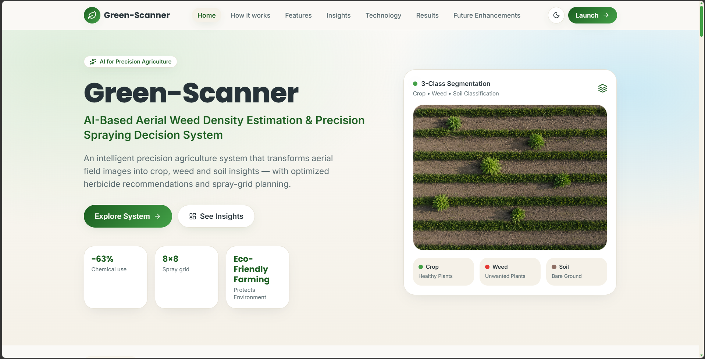
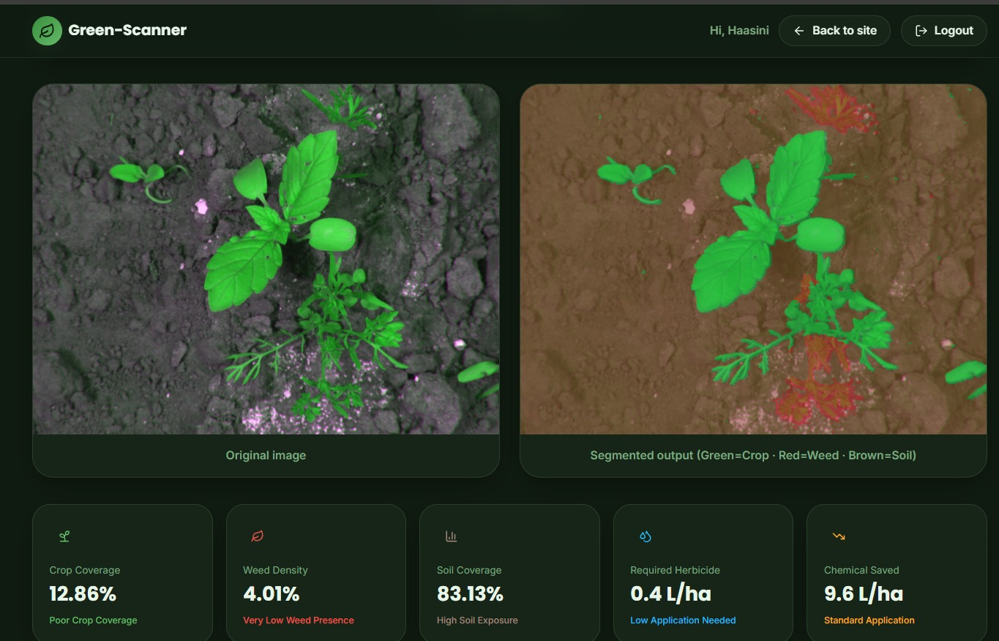
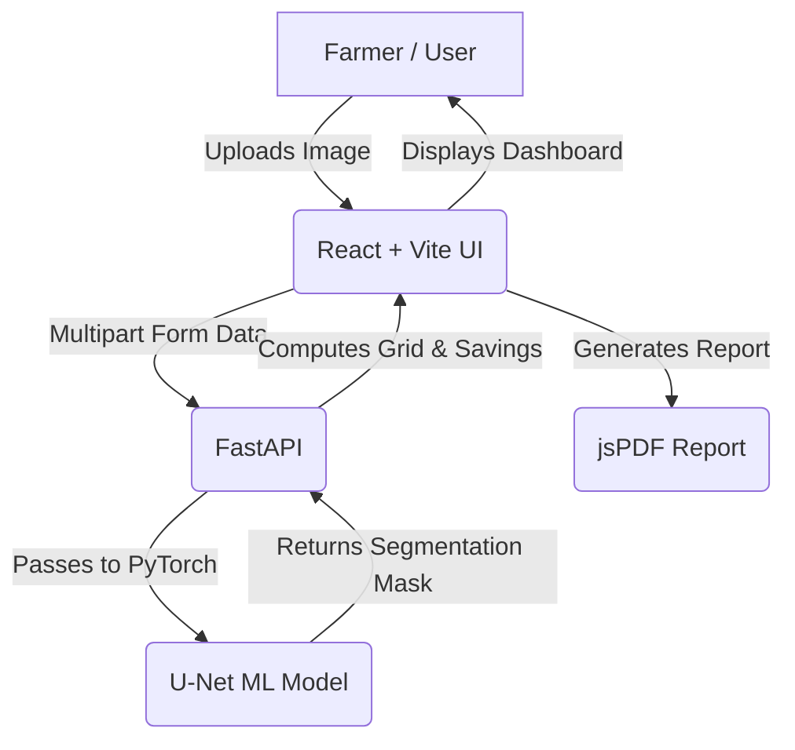

# Green-Scanner 🌿

## 📖 Project Overview
Green-Scanner is an AI-powered precision agriculture platform designed to help farmers analyze aerial drone imagery of their fields. By utilizing a deep learning U-Net model, it segments crop fields into three distinct classes: Crop, Weed, and Soil. The system computes weed density and generates an actionable 8×8 precision spray plan, empowering farmers to optimize herbicide use, save costs, and reduce environmental impact.

## 🖼 Screenshots
- 
- 

## ✨ Features
- **AI Semantic Segmentation**: Custom PyTorch U-Net model classifies every pixel as Crop (Green), Weed (Red), or Soil (Brown).
- **Precision Spray Grid (8x8)**: Generates an actuator grid showing exactly which zones require herbicide (ON) and which don't (OFF).
- **Cost & Chemical Savings**: Automatically computes herbicide saved in liters and estimated dollar savings per acre compared to blanket spraying.
- **PDF Report Generation**: Downloadable professional PDF reports summarizing the field analysis, visual masks, metrics, and AI recommendations.
- **Modern User Interface**: A responsive, beautifully designed frontend featuring glassmorphism aesthetics and a sleek Dark Mode.
- **User Authentication & History**: Secure local-storage-based user sessions to save and review past field analyses.
- **Smart Fallback System**: A built-in "mock mode" allowing users to test the UI and PDF generation even when the trained model isn't locally available.


## 🌐 Live Demo Links
- **Live Demo Site**: https://green-sight-eight.vercel.app/dashboard
- **Video Walkthrough**: https://drive.google.com/file/d/1xzcw8ONHyvc9S4ATDKNMOb0023PXVJ_M/view?usp=sharing

## 🛠 Technology Stack
### Frontend
- **Framework**: React 18 with Vite
- **Routing**: TanStack Router
- **Styling**: Vanilla CSS with modern custom properties (CSS variables)
- **PDF Generation**: jsPDF
- **Icons**: Lucide React

### Backend
- **Framework**: FastAPI, Uvicorn
- **AI/ML Engine**: PyTorch, OpenCV, NumPy
- **Model Architecture**: U-Net Convolutional Neural Network (CNN)

## ⚙️ Installation Guide

### Prerequisites
- Node.js (v18+)
- Python (3.9+)
- Git

### 1. Clone the repository
```bash
git clone <your-repository-url>
cd GreenSight-AI
```

### 2. Setup the Frontend
```bash
npm install
npm run dev
```
The frontend will start at `http://localhost:8082`.

### 3. Setup the Backend
Open a new terminal window:
```bash
cd backend
pip install -r ../requirements.txt
uvicorn main:app --reload --host 0.0.0.0 --port 8000
```
The backend API will run on `http://localhost:8000`.

### 4. Setup the Trained AI Model
Due to GitHub file size limits, the trained model (`.pth`) is ignored in version control.
Place your `unet_crop_weed_soil.pth` file inside the `backend/models/` directory. 
*(If the model is missing, the backend will gracefully fallback to a mock mode for testing purposes).*


## 📐 Project Architecture



## 🚀 Future Enhancements
- **Multi-Field Management**: Allow farmers to draw boundaries on a live map (e.g., Google Maps API) for fleet tracking.
- **Cloud Database Integration**: Migrate from local storage to PostgreSQL via Supabase or Firebase to sync histories across devices.
- **Additional Crop Models**: Train new weights for specific cash crops like corn, soybean, and wheat.
- **Drone API Integration**: Direct integration with DJI or Pixhawk drone SDKs for real-time video feed analysis.
- **Advanced Weather Data**: Integration with weather APIs to suggest the optimal day and time to spray based on wind and rain forecasts.
